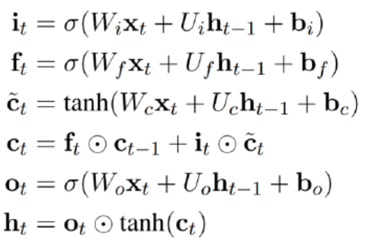

## hw05 解释ppt中lstm的结构

公式中的符号已经在图中标注。待训练的数据有：  
1）Input Gate 的权重和偏置值：Wi,Ui,bi；  
2）Output Gate 的权重和偏置值：Wo,Uo,bo；  
3）Forget Gate 的权重和偏置值：Wf,Uf,bf；  
4）待训练数据的权重和偏置值：Wc,Uc,bc；  
Input Gate, Output Gate, Forget Gate 输入的数据是相同的，包括待训练数据xt 和上一次的输出ht-1；  
Cell 的输入ct~为和上次的cell 输出ct-1，其中it 用于控制ct~的输入强度；而ft 用于控制ct-1 的输入强度；  
Cell 的输出ct，经过激活函数tanh 处理；  
ht 为整个block 的输出，ot 用于控制tanh(ct)的输出强度。  
